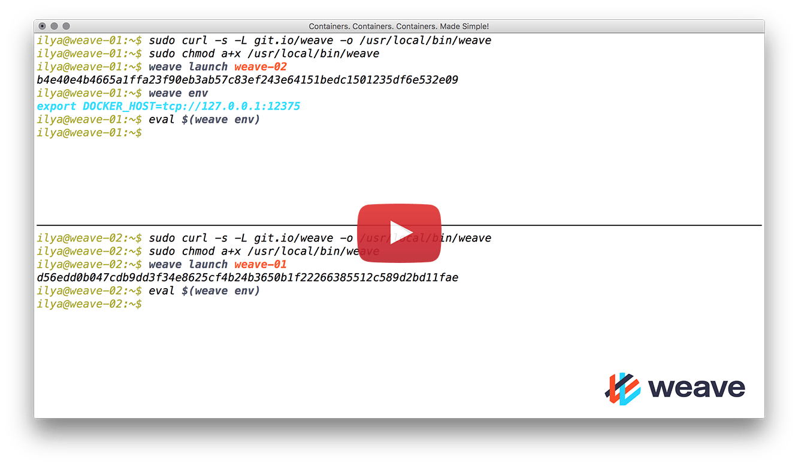

Ensure you are running Linux (kernel 3.8 or later) and have Docker
(version 1.12.0 or later) installed.

Install Weave Net by running the following:

    sudo curl -L https://reweave.azurewebsites.net/get-weave -o /usr/local/bin/weave
    sudo chmod a+x /usr/local/bin/weave

You can also fetch a particular version of Weave Net by specifying a `?version=` query string, like this:

    sudo curl -L https://reweave.azurewebsites.net/get-weave?version=v2.8.8 -o /usr/local/bin/weave

Supported versions start from 2.8.2, the first release since forking from weaveworks/weave.

The URL https://reweave.azurewebsites.net/get-weave, is provided by the companion project [weave-endpoint](https://github.com/rajch/weave-endpoint).

Weave Net respects the environment variable `DOCKER_HOST`, so that you can run and control a Weave Network locally on a remote host. See [Using The Weave Docker API Proxy]({{ '/tasks/weave-docker-api/using-proxy' | relative_url }}).

With Weave Net downloaded onto your VMs or hosts, you are ready to launch a Weave network and deploy apps onto it. See [Launching Weave Net]({{ '/install/using-weave' | relative_url }}).

### Quick Start Screencast

> **Note:** The screencast uses an old download URL, `https://git.io/weave`. This still serves an old version of Weave Net, and should not be used any more. Instead, `https://reweave.azurewebsites.net/get-weave` should be used.

### Checkpoint

Weave Net [periodically contacts Weaveworks servers for available
versions](https://github.com/weaveworks/go-checkpoint).  New versions
are announced in the log and in [the status
summary]({{ '/troubleshooting#weave-status' | relative_url }}).

The information sent in this check is:

 * Host UUID hash
 * Kernel version
 * Docker version
 * Weave Net version
 * Network mode, e.g. 'awsvpc'

To disable this check, run the following before launching Weave Net:

    export CHECKPOINT_DISABLE=1

> **Note:** Weaveworks does not maintain these servers any more. Weave Net will make the call and silently fail. This will not affect normal operations. Still, it is recommended to set the `CHECKPOINT_DISABLE` variable as shown above. Starting from v2.8.2, the `CHECKPOINT_DISABLE` variable is set by default. This feature will be removed from the community-supported Weave Net in the near future.

### Guides for Specific Platforms

> **Note:** The community that currently maintains Weave Net lacks the manpower and resources to support specific platforms at the moment. We would welcome any help.

#### AWS

If you're on Amazon EC2, the standard installation instructions at the
top of this page, provide the simplest setup and the most flexibility.
A [special no-overlay mode for EC2]({{ '/tasks/manage/awsvpc' | relative_url }}) can
optionally be enabled, which allows containers to communicate at the
full speed of the underlying network.

#### GCP

To make encryption in fast datapath work on Google Cloud Platform, see
[here]({{ '/faq#ports' | relative_url }}).

**See Also** 

 * [Launching Weave Net]({{ '/install/using-weave' | relative_url }})
 * [Features]({{ '/overview/features' | relative_url }})
 * [Troubleshooting]({{ '/troubleshooting' | relative_url }})
 * [Building]({{ '/building' | relative_url }})
 * [Using Weave with Systemd]({{ '/install/systemd' | relative_url }})
